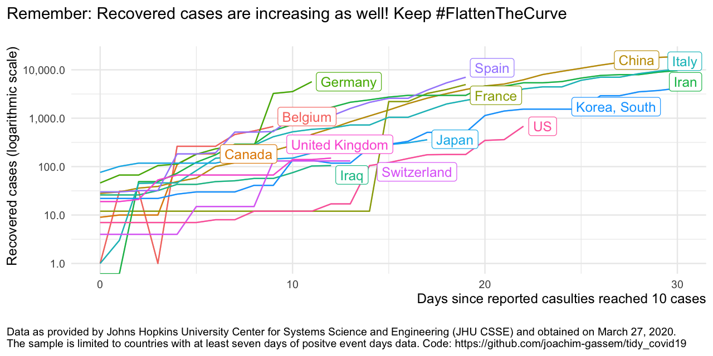
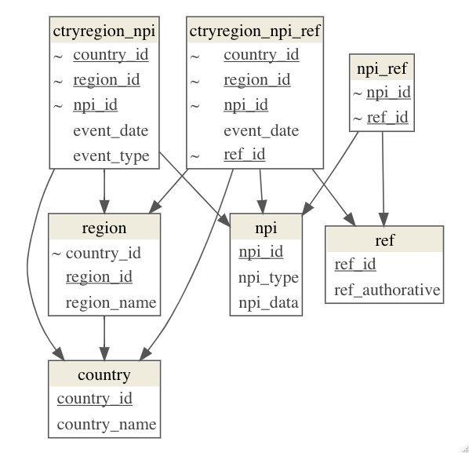

```{r setup, include=FALSE}
set.seed(42)
knitr::opts_chunk$set(echo = TRUE, warning = FALSE, message = FALSE, cache = TRUE)
library(tidyverse)
library(rdfanalysis)
library(knitr)
```

# A repository for maintaining COVID-19 data in R

## Disclaimer

I am an applied economist studying the economic effects of regulatory 
interventions on corporate transparency and leading the Open Science Data Center (OSDC) of the [TRR 266 Accounting for Transparency](https://accounting-for-transparency.de), wich is funded by the German Science Foundation (DFG).
The OSDC has the objective to make research transparent in a way that others 
can contribute and collaborate.

This is the spirit that motivated me to set up this repository. I am clearly no
epidemiologist so I will abstain from analyzing the spread of the disease or
estimating the effects of non-pharmaceutical interventions. Instead this 
repository serves the purpose to facilitate the use of various Covid-19 related
data sources with a special focus on non-pharmaceutical interventions as this
type of data is closer to my domain knowledge.

In that way, I hope that it might be helpful for others that are
interested in doing research on the Covid 19 pandemic by promoting the benefits 
of open science.

## Blog post

[Click here](https://joachim-gassen.github.io/2020/03/merge-covid-19-data-with-governmental-interventions-data/) for the blog post that showcases some descriptive visuals to see what one can do with the data retrieved by this project.


## Data

This repository is not containing any self-collected or generated data. Instead
it currently builds on three external, publicly available data sources

- The [Covid-19 data from the Johns Hopkins University CSSE team](https://github.com/CSSEGISandData/COVID-19). This data has developed to a standard resource for researchers and the general audience 
interested in assessing the global spreading of the virus.
- The [Government measures dataset provided by the Assessment Capacities Project (ACAPS)](https://data.humdata.org/dataset/acaps-covid19-government-measures-dataset). These relatively new data allow researchers to study the effect of non-pharmaceutical interventions on the development of the virus. 
- Additional country level information provided by the [World Bank](https://data.worldbank.org). These data allow researchers to calculate per capita measures of the virus spread and to assess the association of macro-economic variables with the development of the virus.


## Code

The `code` directories contains the following R code files:

- `import_jhu_csse_covid19_data.R` Imports the JHU CSSE data on the global spread of the Covid-19 pandemic, aggregates the data at the country level, and adds ISO3c country indicators. See [this blog post](https://joachim-gassen.github.io/2020/03/tidying-the-new-johns-hopkins-covid-19-datasests/) for more information on the code.
- `import_acaps_npi.R` Imports the ACAPS Government measures data, and fixes some minor inconsistencies in the category labels.
- `import_wbank_data.R` Imports current country-level World Bank data.
- `merge_data.R` Merges data from the three data sources into a country-day panel data set.
- `descriptive_analyses.R`: Generates some descriptive visualizations of the data. You can use it as a starting point for your own analyses.

The quickest way to pull the data and to run the analysis is to hit 'Build all' in the Build tab of RStudio. Alternatively, at the Termninal, you can enter 'make all'. After that you should have all the data stored in the `data` directory and be able to run the code in `code/descriptive_analyses.R`.

## Alternative data sources for non-pharmaceutical interventions

As far as I can tell, there is no commonly accepted data repository for non-pharmaceutical interventions yet. Besides the ACAPS repository above, these are additional data sources that I identified (partly with the help of the recent [data are plural newsletter](https://tinyletter.com/data-is-plural/letters/data-is-plural-2020-03-25-edition)):

- [An intiative by the Blavatnik School of Government, University of Oxford](https://www.bsg.ox.ac.uk/research/research-projects/oxford-covid-19-government-response-tracker) 
- [A project hosted by Rex W. Douglass, UC San Diego](https://github.com/rexdouglass/TIGR)
- [A repository generated by a team in the recent German hackatron #WeVsVirus](https://devpost.com/software/1757_flattenthecurve_predictivemodeling-tyeo67)
- [A current work in process project by Sam Abott and Co-authors](https://github.com/seabbs/CovidInterventionReview)

I am virtually certain that this list is incomplete and would very much appreciate additional pointers that I can include here.





## Appendix

### A concept for a data model for maintaining a decentralized intervention repository

As far as I can see, one of the key challenges to build and maintain a high quality interventions repository is that global domain knowledge is needed and that interventions come at various jurisdictional levels. Also, interventions vary in specifics. Currently, all repositories are centralized. Below you find a sketch of a suitable data model that could be used to build decentralized repositories. 



The data model is constructed around the following key relations:

- Non-pharmaceutical interventions, classifying them in broad categories and offering a separate descriptive data structure for each category (relation `npi` in the model above)
- Events where these interventions are established or removed in certain countries and/or regions (relation `ctryregion_npi`)
- References to URLs that explain the NPIs (and/or their related events) in more detail and whether these references are from authoritative to secondary sources (relation `ref`)
- Secondary relations that categorize countries and regions (relations `region` and `country`)

Additional aspects that could be included are a relation that links countries/jurisdictions/regions and, if this data model is set up in decentralized repositories, a meta structure that links these repositories. Finally, a relation that captures quality review processes would enhance the reliability of the data.

This section reflects my thought process while I was collecting information on existing repositories. It is not meant to criticize any of the existing activities. Needless to say, I am open for feedback and requests for collaboration.


### References

I try to keep an updated list of references to give credit to the data providers for this repository. Please reach out if you feel that a reference is missing or should be updated.

- Dong E, Du H, Gardner L. An interactive web-based dashboard to track COVID-19 in real time. Lancet Infect Dis; published online Feb 19. https://doi.org/10.1016/S1473-3099(20)30120-1.

